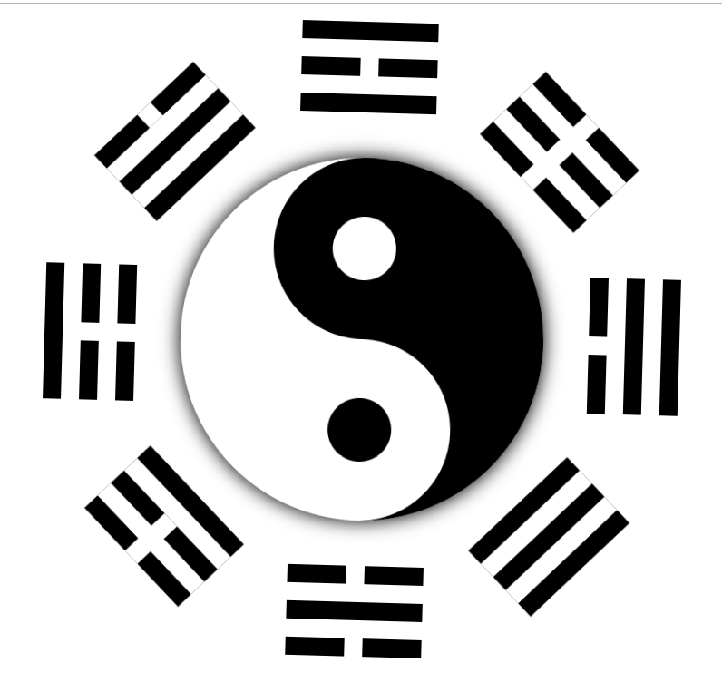

# 太极八卦

太极八卦即是阐明宇宙从无极而太极，以至万物化生的过程。其中的太极即为天地未开、混沌未分阴阳之前的状态。两仪即为太极的阴、阳二仪。《系辞》又说：“两仪生四象，四象生八卦”。其意指浩瀚宇宙间的一切事物和现象都包含着阴和阳，以及表与里的两面。而它们之间却既互相对立斗争又相互资生依存的关系，这即是物质世界的一般律，是众多事物的纲领和由来，也是事物产生与毁灭的根由所在。

它是中国古代道家论述万物变化的重要经典－－《周易》中用的八种基本图形，亦称八卦，用 `-` 和 `--` 符号组成。名称是：

乾、坤、震、巽、坎、离、艮、兑。

象征天、地、雷、风、水、火、山、泽八种自然现象，以推测自然和社会的变化。认为阴、阳两种势力的相互作用是产生万物的根源，乾、坤两卦则在“八卦”中占有特别重要的地位。
太极和八卦组合成了太极八卦图，它又为以后的道教所利用。道家认为，太极八卦意为神通广大，镇慑邪恶。

太极八卦图，以同圆内的圆心为界，画出相等的两个阴阳鱼表示万物相互关系。阴鱼用黑色，阳鱼用白色，这是白天与黑夜的表示法。阳鱼的头部有个阴眼，阴鱼的头部有个阳眼，表示万物都在相互转化，互相渗透，阴中有阳，阳中有阴，阴阳相合，相生相克，即现代哲学中和矛盾对立统一规律表示法。

**我们今天就来简单的实现下！**

